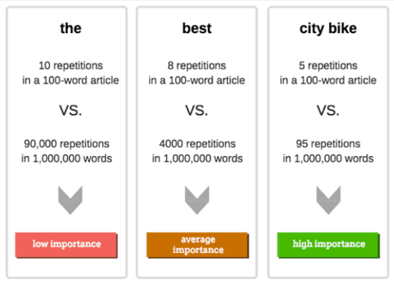

# TF-IDF & Similitud entre vectores usando cosenos

Este es el repositorio que contiene el modelo de machine learning para recomendar películas según la interacción que se tenga con la aplicación (likes a las películas). El algoritmo que se usa para recomendar películas es el TF-IDF.

-TF: Frecuencia del Término. 
Mientras mayor sea la frecuencia del término en los documentos, mayor será su importancia.

-IDF: Frecuencia inversa de documentos
Mientras mayor sea la frecuencia del término en los documentos, menor será su importancia. 

Este es un cálculo estadístico adoptado por el algoritmo de Google para medir cuáles términos son más relevantes para el usuario, analizando la frecuencia de las páginas con las que interactúan junto con la frecuencia en un conjunto más grande de páginas.

Como ya se sabe, no solo se usa en motores de búsquedas de internet, también se usa en sistemas bibliotecarios, en minería de datos, entre otras áreas.

## ¿Cómo funciona el proyecto?

Se utilizó Flask para definir una API sencilla que recibiera una solicitud de la API definida en .NET, cuando el endpoint que recomienda películas se ejecute. 

El código está diseñado para recomendar películas basadas en la similitud de género entre películas y lo hace de la siguiente manera:

### Vector tf-idf:

Funciona para textos, sin embargo, posee propiedades que son útiles para este proyecto, en orden de obtener un vector que represente la data que se necesita.

El cálculo del IDF considera qué términos se repiten frecuentemente en los textos, como artículos y conjunciones (el, la, lo, y, pero, que, etc.), y no tienen relevancia para los documentos. Cuando el factor IDF se incorpora dentro de la fórmula (que será mostrada más adelante), el cálculo disminuye el peso de los términos que ocurren con mucha frecuencia en el conjunto de documentos y aumenta el peso de los términos que aparecen más raramente.



La expresión que explica lo anterior, es la que se muestra a continuación:


Siendo: 

```bash
 1) i: Índice de una palabra clave en particular. Por ejemplo, si hay 10 palabras clave en un documento, i puede variar de 1 a 10.

 2) j: Índice de un documento en particular. Por ejemplo, si hay 100 documentos en un conjunto, j puede variar de 1 a 100.

 3) tf: Número total de ocurrencias de i en j.

 4) df: Número total de documentos que contienen i.

 5) N: Número total de documentos.

 6) tf,j: Frecuencia de la palabra clave i en el documento j.

 ```

 El logaritmo suaviza el resultado de la división, es decir, mientras el número de palabras se menor en un documento (dfi, que representa el numero de veces en el que un género de película aparece en la base de datos), su peso será mayor.

### Similitud:

La similitud, en matemática, se puede definir como el coseno del ángulo entre dos vectores siendo comparados.


Esta fórmula también puede ser vista como el producto escalar entre dos vecotres, siendo "alpha" el angúlo del coseno entre "A" y "B". Si la similitud es 1, significa que las películas tienen el mismo género.

Mientras el valor del ángulo sea más cercano a 1, las películas tendrán mayor similtud.

## Instalación

En Visual Studio Code, se hizo la instalación de las siguientes dependecias:

1- Venv: Entorno virtual para aislar determinadas dependencias, de modo el interpretador pueda reconocer pandas.

Para instalarlo y ejecutarlo:

```bash

1) > pip install virtualenv

2) > venv mi_entorno_virtual

2) > venv/scripts/activate 

3) > python mi_script.py
 ```


    

